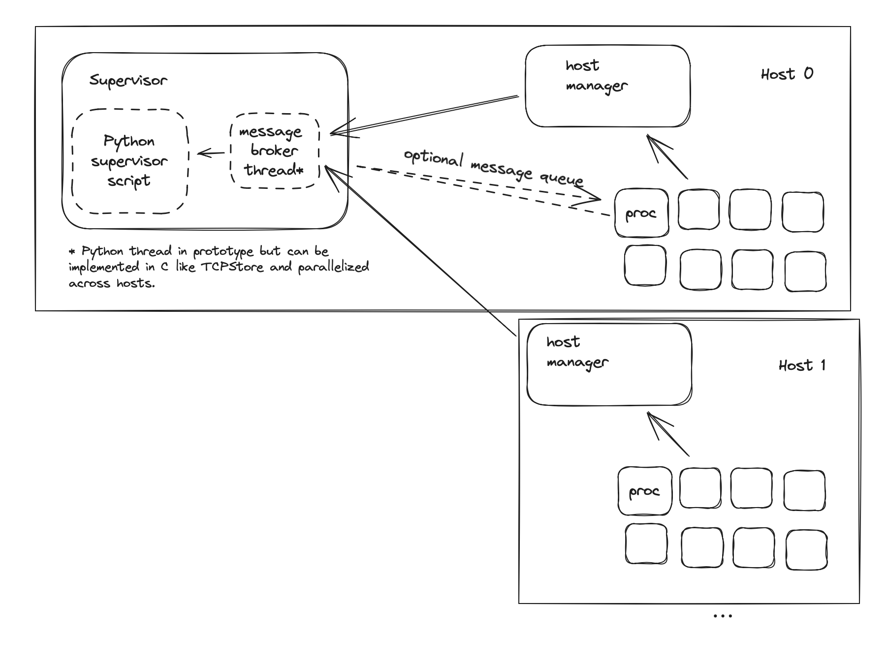

## **A simple supervision API for fast in-container restart**

[Prototype source](https://github.com/zdevito/single_controller/blob/main/test/example/supervise.py)

At large scale, hardware and software errors are inevitable, and any system that is sensitive to stragglers has to have some policy for restarting when an error happens that stops progress. This document proposes a simple API for doing cross-host supervision that makes it easier to build hackable policies for in-container restart, and build tools for gathering debug info.

## **Motivation**

_"All happy families are alike; each unhappy family is unhappy in its own way." - Tolstoy_

While successful progress in training always look the same (training iterations go up), failures manifest in a huge number of ways: various deadlocks (NCCL bugs), hardware error (GPU fallen of bus), software bugs (race conditions, NaNs appear), network problems (link down), etc. It is not possible to anticipate how each training run will go, especially as new hardware is rolled out.

Instead, we can improve the experience of keeping training running by making it easy to adjust our approach to restarting, and making it easy to debug what goes wrong.

**Separating Mechanism and Policy** A policy is something like "when we do not advance iterations in one minute, gather debug information from each machine, kill the training processes, and restart them on working machines." Mechanisms are the actions used to implement policies such as listening to a heartbeat, issuing kill signals, seeing if machines respond to messages, and launching processes.

Cleanly separating out the mechanisms makes it a lot quicker to tweak policies to adjust to new failure modes since it can all be adjusted in a single script.

**Advanced Telemetry for Debugging** When failures happen, the source is not necessarily the first process to report or to notice a hang. Some more global analysis has to happen to debug, such as aggregating NCCL flight recorder data, or attaching py-spy or gdb to stuck processes.

The proposed API introduces a **supervisor script that runs on one host* and implements a policy for restarting and gathering debug information.** We first describe the mechanisms, and then show how a restart policy can be crafted from them. The eventual goal would be to have this API available as part of the Torch Elastic toolkit for use when more flexibility for job management is desired.

* A host refers to one machine with some number of GPUs attached to it.

## **Proposed Mechanisms**

[https://github.com/zdevito/single_controller/blob/main/supervisor/__init__.py](https://github.com/zdevito/single_controller/blob/main/supervisor/__init__.py)

The general setup is that a supervisor process runs on one host and manages the job. Each host associated with the job has a host manager process that communicates the state of local processes to the supervisor. Training jobs are processes that get launched by these managers at the direction of the supervisor process:

(Note that this setup is nearly identical to what we implement in Torch Elastic today, but with the supervisor replacing the TCPStore, which is already a single server connected to each host.)

The supervisor then provides APIs to:

**Reserve/Release Hosts** We need to acquire hosts, return them, and replace them when it discovers a host not behaving correctly. Here is an example of how the Python supervisor script would use the API:

We can implement this API today based on MAST's functionality (and other similar schedulers). We start the job with MAST the normal way, running a host manager process on each host that checks in with the supervisor which is launched on a single host (similar to Torch Elastic rendezvous today). `request_hosts` on the supervisor attaches the hosts objects in the API to the host machines that have checked in with the supervisor. The `replace_hosts` API is implemented by sending a message to the broken host's manager process to abort with non-zero exit code. The job scheduler can then replace that host with a new one whose management process will check in with the supervisor and get assigned as the replacement.

**Create/Monitor/Message Processes** Because certain actions like recovering a broken NCCL communicator are not recoverable within process, we need a way to launch training as a sub-processes across the hosts:

The API provides ways to wait on the completion of processes through `Future` objects. `as_completed` returns futures as they complete:

The API also provides ways to send and receive messages from processes. This API is optional for trainer processes but can provide a way to do advanced telemetry. As an example, a heartbeat that the training produces to indicate progress:

Or a request to all the machines to gather debug information:

## **Proposed Policy**

[https://github.com/zdevito/single_controller/blob/main/test/example/supervise.py](https://github.com/zdevito/single_controller/blob/main/test/example/supervise.py)

Given the above mechanisms, we can look at how we would create a policy for running a large job running on sometimes flaky machines. The policy is simply a script that uses the above API. We can start with some pre-written scripts, but the intent is to edit a script over the course of training a large job to make the training more robust to the errors that pop up.

Let's start with the outer loop. We get handles to our set of hosts, launch training, wait for something to fail, and re-launch training:

The more interesting bit is how we launch the job in the face of potentially flaky machines and stragglers, which is contained in how we choose to start our training process inside `start_training`.

Overall we will assume that some of our hosts might be unhealthy or slow at certain tasks. To get a good set of machines to run on, we will run a `health_check.py` script that will score each host (or fail, or hang on really unhealthy hosts). This script can be composed out of existing healthy/unhealthy checks, but it can also do benchmarking to allow us to rank machines to avoid stragglers. Then we choose the top scoring machines that responded as our hosts to run on. This approach filters bad hosts, and furthermore the startup process is not slowed down by stragglers because we do not wait to hear from everyone. The comments below show how we use our API mechanisms to achieve this:

## **Future Policies**

The mechanisms in this API enable future functionality that would restart faster, and make debugging easier. A few examples:

* **A coordinated heartbeat.** The supervisor can listen, through message passing, to the progress of the training job and take action if the job slows in progress. Because it is easy to modify the supervisor script along with the training job, it should be possible to achieve much smaller timeouts compared to a generic stuck job detector based on the performance expectations of the job. For instance, a custom progress policy can measure the average iteration time (e.g. 20 seconds), pause the progress measure when the training is doing evals or checkpointing, and take action when the training time is above expected.
* **Host-wide debug telemetry.** We have many cases where on a hang or error, information needed to debug the problem is spread across hosts that might not even know an error has happened that needs to be debugged. The messaging API is a way to request and gather data from all trainers. For instance, we can ask the trainers to dump NCCL flight recorder data, memory allocation information. We can also use the process launch APIs to launch a new script on each machine to attach py-spy, gdb, or cuda-gdb to the trainers to gather information out of process and aggregate/analyze the results. We do all of this today with ad hoc scripts, or systems engineered for a single purpose. Having a supervisor API would help make these scripts reusable and automated.
* **Faster restarts with in memory checkpointing. **More frequent checkpoints lower the amount of lost work on restart but are limited by disk bandwidth. If we had CPU processes that persist across restarts, we can do in memory checkpointing (example paper: [https://dl.acm.org/doi/10.1145/3600006.3613145](https://dl.acm.org/doi/10.1145/3600006.3613145)) with very frequent checkpoints. The supervisor API provides a way to manage the set of in-memory checkpoint servers separately from the training process so that we can restart training and add hosts to the in-memory checkpoint cache separately.

## **Scaling the Implementation**

We have a prototype of the [supervisor API](https://github.com/zdevito/single_controller/tree/main/supervisor) and [example policy](https://github.com/zdevito/single_controller/tree/main/test/example) that is functionally complete, implemented with [ZeroMQ](https://zeromq.org/)'s Python bindings. It works on a fake trainer process and fake health checks to simulate flaky hosts. The implementation is careful to separate work that has to be done in Python (which can handle lists of 16k items fine) from managing the parallel connections, which we will likely rewrite to C for more scalable performance as we bootstrap scalability up to the number of hosts we actually plan to run.

Any system that manages thousands of hosts needs to do some coordination that might not scale. For instance, to monitor for failure today we need to watch a centralized key value store (TCPStore, etcd, or Zeus) for machines reporting failure. To make the supervisor API scalable enough we may need to make the way it distributes process creation and messaging more parallel, by for example, using a tree-based way of distributing messages, but these changes are pretty simple with ZeroMQ.

## **Next Steps**

There are two directions for next steps: (1) real health checks and jobs, and (2) real scale. For (1), I'd like to hook up the API to existing smaller jobs instances and make sure we can run the appropriate health check scripts in- container. For (2), we can likely test scaling of the API using a bunch of T1 machines to get an estimate of how long different aspects will take as the size of hosts scale.

## **Escape Hatch**

Finally, there is always a chance a new API like this doesn't end up scaling for some unforeseen reason. In this case we have an escape option of using the existing rendezvous mechanisms in Torch Elastic with some modifications to when they consider having enough hosts, and using health checks within their startup to refuse to check in unhealthy machines. While this approach will work for the immediate problem, it does not help with the future policies we want to implement and would make modifying the policy as we discover more failure modalities harder. In both cases we will need to get health check scripts running in container task (1) from above, so there is a lot of overlapped work anyway.
